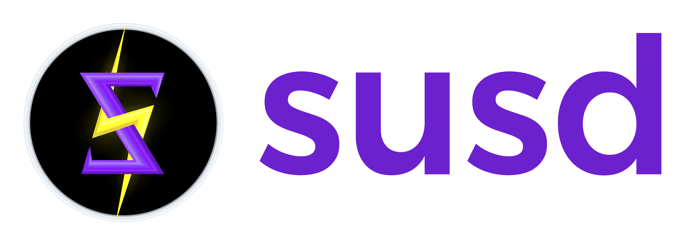

# Be Your Own ₿ank

## What's Syron SUSD?

Syron SUSD is a Bitcoin-native stablecoin that runs on Bitcoin Layer 1 and integrates with the Internet Computer at the protocol level. It is designed to provide broader access to USD liquidity and decentralized finance (DeFi) while maintaining Bitcoin’s security and decentralization.

As TyronDAO’s sovereign dollar, Syron enables capital-efficient Bitcoin loans while keeping BTC in a separate, auditable safety deposit box. This approach ensures users can access liquidity without sacrificing ownership or security.

Being your own bank means you can leverage your Bitcoin (BTC) holdings to mint Syron and access USD-denominated liquidity without giving up control of your BTC. Empowering you with self-sovereign identity (SSI), Syron allows you to retain ownership of your Bitcoin while accessing instant USD liquidity whenever needed. It’s like having a modern-day gold standard—but with Bitcoin, a digital asset of limited supply, instead of gold.

TyronDAO ensures that your collateral is securely held within your control in your Safety Deposit ₿ox (SDB). This setup allows you to mint Syron dollars for various purposes, whether for spending or investment.

Syron’s first implementation as a Bitcoin-native stablecoin uses the Ordinals protocol to combine the stability of the United States dollar with Bitcoin’s growth potential, contributing to the creation of a more inclusive world with financial freedom.


Picture this: you've got 1 BTC and want $20k to join a DEX as a liquidity provider. TyronDAO's stablecoin meta-protocol lets you keep your BTC safe and get dollars straight away. You retain control over your bitcoin's value, allowing it to appreciate while also having dollars accessible for any purpose and DeFi.



