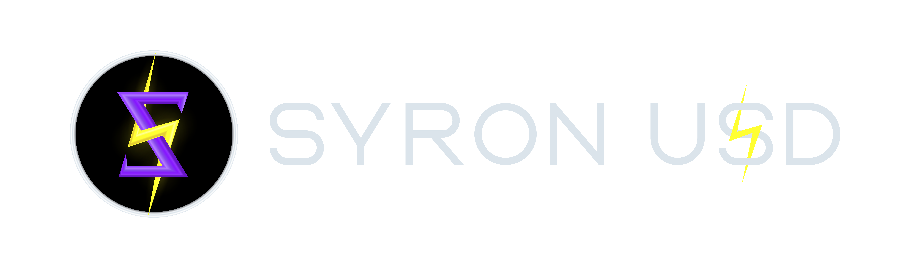

# ₿e Your Own ₿ank

## What's Syron?

The Syron U$ Dollar (SU$D) is a Bitcoin-native stablecoin integrated with the Internet Computer at the protocol level, designed to provide seamless access to USD liquidity and decentralized finance (DeFi) on Bitcoin.

Being your own bank means you can leverage your bitcoin (BTC) holdings to mint SU$D and access liquidity without giving up control of your BTC. Empowering you with self-sovereign identity (SSI), SU$D allows you to retain ownership of your Bitcoin assets while accessing instant USD liquidity whenever needed. It's like having a modern-day gold standard but with bitcoin, a digital asset of limited supply, instead of gold.

The SSI Protocol ensures that your collateral is securely held within your control in your Safety Deposit Box. This setup allows you to mint SU$D tokens for various purposes, whether for spending or investment. Syron is a Bitcoin-native stablecoin that uses the Ordinals Protocol to combine the stability of the U.S. dollar with Bitcoin's growth potential, contributing to the creation of a more inclusive financial world.


Picture this: you've got 1 BTC and want $20k to join a DEX as a liquidity provider. Tyron's stablecoin metaprotocol lets you keep your BTC safe and get dollars straight away. You retain control over your bitcoin's value, allowing it to appreciate while also having dollars accessible for any purpose like DeFi.



