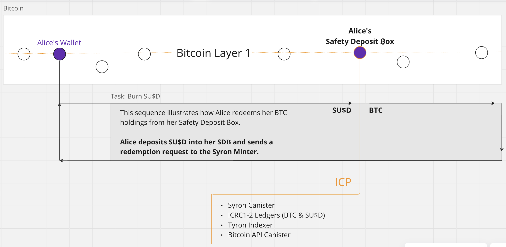
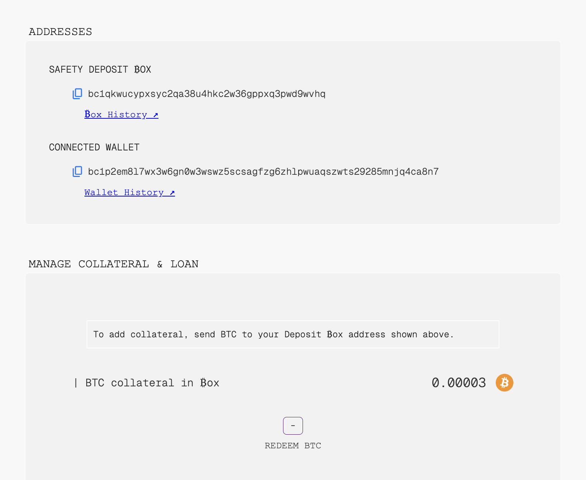

# Burning


**Good to know:** Burning is the process of removing Syron U$ dollars from circulation according to Tyron's stablecoin metaprotocol code.


The purpose of burning SU$D stablecoins is for users to recover or redeem the bitcoin cryptocurrency (BTC) stored in their safety deposit boxes (SD₿).

To do so, a SU$D deposit must be made into the user's SD₿, and then proceed to call the Syron minter canister to request the transfer of BTC from the SD₿ to the user's wallet.

