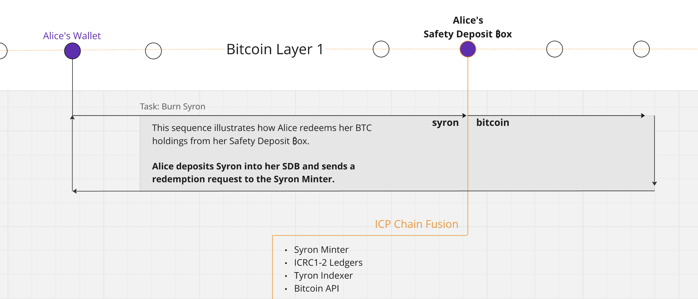

# Burning


**Good to know:** Burning is the process of removing Syron US dollars from circulation according to the our stablecoin meta-protocol.


The purpose of burning SYRON dollars is for users to redeem their bitcoin (BTC) stored in their safety deposit boxes.

To do so, a Syron deposit must be made into the user's SDB, and then proceed to call TyronDAO's canister on the Internet Computer to request the transfer of BTC from the SDB to the user's wallet.

