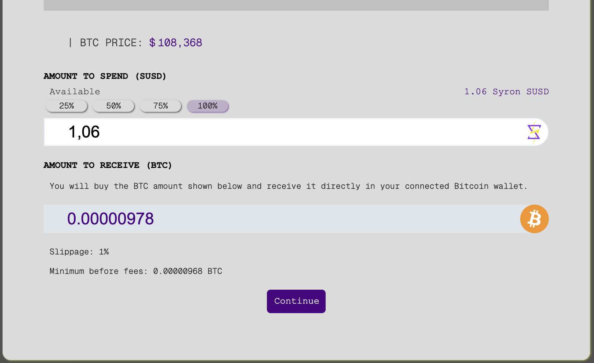
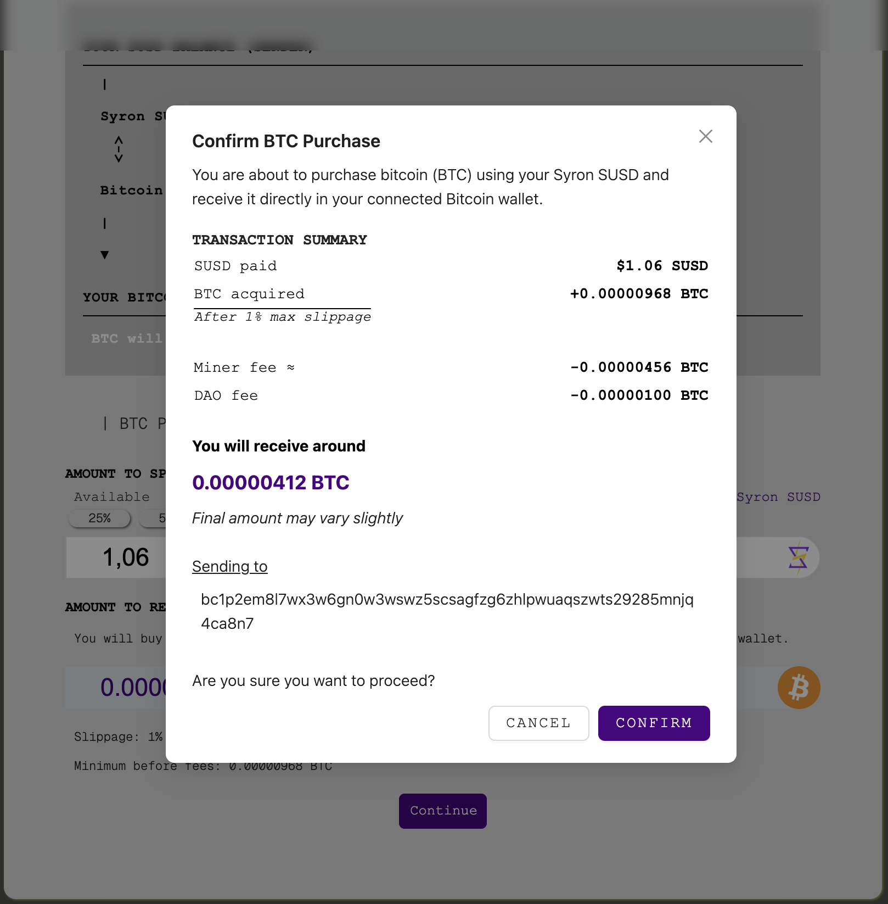

> **TL;DR**  
> ICPayments enable fast, decentralized payments and swaps using Syron and Bitcoin. By integrating with the Internet Computer, it allows near-instant Syron transfers and direct BTC swaps, making Bitcoin practical for everyday transactions.

# ICPayments: Bitcoin-Backed Payments & Swaps

ICPayments represents a significant leap in leveraging Bitcoin for everyday transactions and asset management. Traditionally, Bitcoin's block confirmation times (around 10 minutes) have limited its practicality for quick payments and dynamic swaps. TyronDAO, through its deep integration with the Internet Computer, is working to overcome this challenge by enabling near-instant transfers of Syron SUSD and facilitating direct swaps for BTC.

This innovative system is transforming Syron SUSD into a highly efficient medium for decentralized payments, remittances, donations, and even acquiring more bitcoin, effectively enhancing Bitcoin's utility as a global financial system.

## The Technology Behind

ICPayments is powered by the Internet Computer's unique protocol-level integration with the Bitcoin network, which enables TyronDAO's smart contracts (canisters) to directly interact with Bitcoin, managing SUSD transactions and BTC acquisitions with greater decentralization and security.

## How to Use

To begin using ICPayments functionality, you'll first need to connect your Bitcoin wallet to the TyronDAO dApp.

- **Sign In With Bitcoin (SIWB)**: Access the TyronDAO dApp and Sign In With Bitcoin (SIWB) using your preferred Bitcoin wallet. SIWB is a third-party solution that securely authenticates your Bitcoin wallet and provides you with an Internet Identity on ICP, without requiring you to manage additional private keys.

- **Ensure SUSD Balance**: For both sending SUSD and buying BTC, ensure your Syron SUSD balance is up to date. If you've recently deposited new BTC collateral, you may need to draw SUSD to increase your available balance.

### Sending SUSD

This functionality allows you to send Syron SUSD to other Bitcoin wallets for payments, remittances, or donations.

1. Access the ICPayments Interface: Navigate to the "ICPayments" section in your Syron account and click on "SEND SUSD". This will open the "SEND SYRON SUSD" modal.

2. Review Receiver Details: Under "RECIPIENT'S PERSONAL WALLET ADDRESS", you will be prompted to enter the recipient's Bitcoin wallet address (NOT their safety deposit box address).

**Note**: Syron SUSD will be transferred from your 'Available SUSD balance' to the recipient's Syron account. The recipient must log in with their Bitcoin personal wallet to access the funds.

3. Enter SUSD Amount: In the "AMOUNT TO TRANSFER (SUSD)" section, input the amount of Syron SUSD you intend to send. You can manually enter the amount or use the quick percentage buttons (25%, 50%, 75%, 100%) to select a portion of your available balance.

4. Review and Confirm: Verify all transaction details, including the recipient's address and the amount, before confirming the payment. Your SUSD payment will be processed near-instantly, backed by the security of Bitcoin and the speed of the Internet Computer.

### Buying BTC with SUSD (Syron Swaps)

This feature allows you to use your Syron SUSD balance to directly acquire more bitcoin (BTC) within the TyronDAO dApp.



1. Access "Buy BTC" Modal: Navigate to the "ICPayments" section and click on the "BUY BTC" button to open the purchase modal.

2. Choose SUSD Amount: Within the modal, specify the amount of SUSD you wish to spend to buy BTC.

3. Review Transaction Details: Carefully examine the transaction confirmation modal before proceeding. This modal provides a comprehensive summary of your purchase:

If all details are correct, click "CONFIRM" to finalize your Bitcoin purchase. After confirmation, always double-check the transaction on your preferred Bitcoin explorer for full transparency.


Visit the TyronDAO website for more insights into ICPayments.

