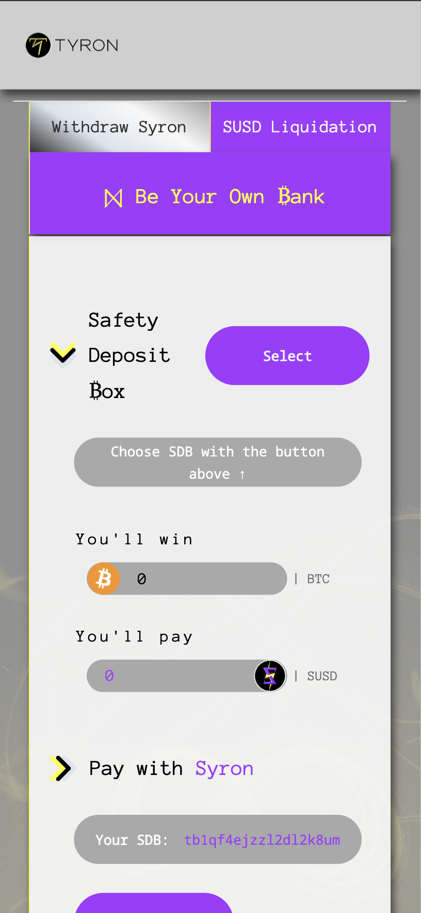
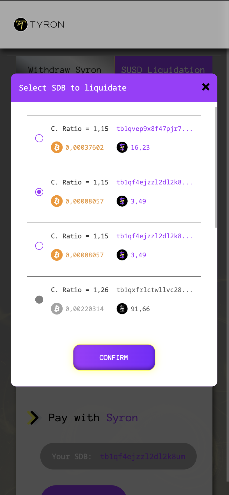
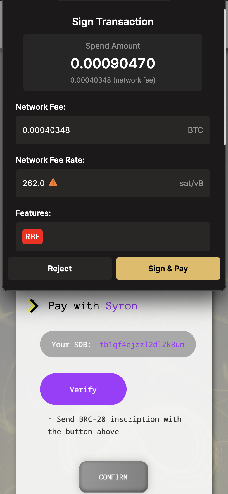
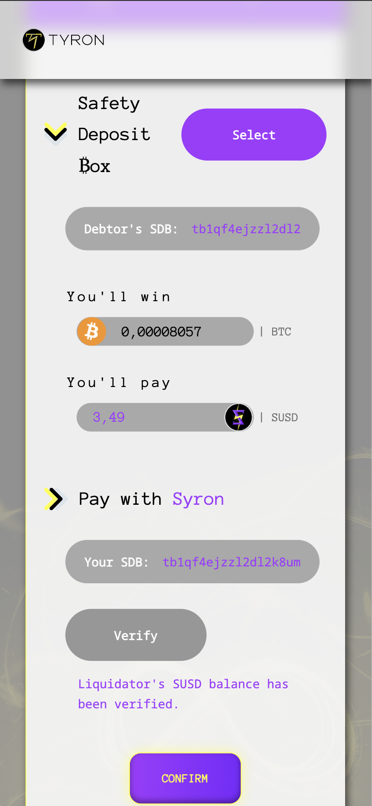

# Liquidation


**Good to know:** Liquidation in the context of Syron refers to the process of repaying a debtor's SUSD loan and receiving the debtor's collateral in return. Since Syron USD is over-collateralized with Bitcoin, the value of the collateral exceeds the value of the loan. As a result, the liquidator, who repays the SUSD loan, earns a BTC surplus that represents a profit.


By understanding the liquidation process in Syron, you can better appreciate the mechanisms that ensure the stability and reliability of Syron USD as a stablecoin. Liquidation not only protects the system from depegging (i.e., SUSD losing its parity with the USD due to under-collateralized loans) but also provides financial opportunities for liquidators like you: Be Your Own ₿ank.

### How to Liquidate an SDB

To liquidate a Safety Deposit ₿ox (SDB) that is below the collateral ratio limit of 1.2, and acquire the Bitcoin it contains, simply follow these steps:

1. **Select the SDB to Liquidate**: Choose the SDB you want to liquidate. At this step, when you press confirm, you will see the account address you are about to liquidate, the amount of BTC you will receive and the SUSD you need to pay displayed on the app at [Bitcoin.TyronDAO.org](https://Bitcoin.TyronDAO.org):

2. **Verify Your Account**: You will need to verify your account. Simply click on the verification button. As part of this step, you will send a transfer-inscription to your SDB to enable the SUSD payment.

- **a.** If you have the necessary balance to perform the liquidation of the chosen SBD, the verification will be successful, and you can proceed.

- **b.** If your balance is insufficient, you have to deposit SUSD into your own SDB from any Bitcoin wallet, such as UniSat.

3. **Complete the Payment**: Once your account is successfully verified, click on the Confirm button, wait for the request to process, and then enjoy your BTC, which you will receive directly in your wallet.

The following YouTube video shows the above step-by-step guide pertaining to the process of liquidation:


