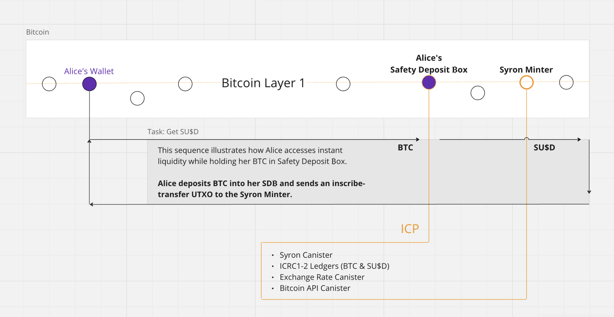

# Minting


**Good to know:** Minting is the process of withdrawing Syron US dollars according to the Syron stablecoin meta-protocol.


Our innovative approach to Bitcoin-native stablecoins aims to empower users to unlock the potential of their BTC holdings through Self-Sovereign Identity (SSI). In this context, SSI involves a decentralized identity paradigm where online data, such as digital money, is managed not in centralized silos but through Distributed Ledger Technologies like Bitcoin and the Internet Computer. Additionally, in SSI, the subject of the identity also serves as the controller, ensuring that no one else can claim control of the user’s funds.

On Tyron, this paradigm is realized through safety deposit boxes, each independently holding the BTC collateral (one ₿ox per user). This setup ensures users maintain complete control over their assets without reliance on third parties.



## Syron Bitcoin Minter

The Syron minter is an Internet Computer canister with its own Pay-to-Witness-Public-Key-Hash (P2WPKH) Bitcoin address. This wallet holds Syron US dollars (SYRON) as BRC-20 [tokens](./token.md) corresponding to the premine amount.

The SYRON stablecoin includes two ledgers: one to record BTC collateral and another one for SYRON balances, including the details about the dollars available for withdrawal.

### Safety Deposit ₿ox

Tyron computes the wallet address of the user's SDB with a P2WPKH script. To do so, it defines the user's Bitcoin wallet address as the SSI to include its value as part of the derivation path used in Chain Fusion's advanced cryptography, leveraging ICP's threshold ECDSA.

For user computations, the meta-protocol considers the minter canister's ID and a subaccount that incorporates the user's wallet.

```rust
let sdb_subaccount: Subaccount = compute_subaccount(1, &args.ssi);
```

Here, 1 represents the nonce of the SDB, and `&args.ssi` refers to the user's Bitcoin wallet address.

This user's wallet address (SSI) is also appended at the end of the derivation path:

```rust
vec![
    ByteBuf::from(SCHEMA),
    ByteBuf::from(MINTER),
    ByteBuf::from(SUBACCOUNT),
    ByteBuf::from(SSI)
]
```

Once the user's SDB wallet is known, the next step is to make a BTC deposit.

### Using an SDB

In principle, anyone can send a BTC transfer to an SDB in a permissionless manner. Security measures to prevent illicit activities can be implemented by utilizing the Know Your Transaction canister developed by DFINITY.

All deposited UTXOs into an SDB are tracked on the Internet Computer by considering all satoshis as the provided BTC collateral. Tyron's stablecoin meta-protocol is backed solely by BTC in an over-collateralized manner, ensuring that the collateral's value exceeds 1.5 times the amount of SYRON dollars users can withdraw from their SDB.

### Withdrawing Syron

To withdraw SYRON, users request a balance update and provide the ID of an inscribe-transfer transaction submitted on Bitcoin. This BRC-20 inscription is verified using Ordinals indexers.

TyronDAO utilizes the Internet Computer to record ledger balances of BTC deposits and SYRON balances. In these ledgers, several accounts come into place:

- Subaccount with nonce 1 for the Bitcoin collateral and SYRON borrowed.
- Subaccount with nonce 2 for dollars available for withdrawal (SYRON balance), and nonce 3 for SYRON dollars withdrawn as BRC-20 tokens.

Additional subaccounts can be employed to account for withdrawals to other blockchain protocols like Bitcoin Runes and Ethereum. Our ledgers on ICP utilize the Syron minter's principal ID as the accounts' owner with subaccounts made out of the user's Bitcoin wallet and a specific nonce - as mentioned above.

If this transaction fails, the ledger must reflect the unsuccessful withdrawal in the selected protocol. Consequently, users can request it again, and the meta-protocol validates the request by referring to subaccount 2 of pending Syron withdrawals.


