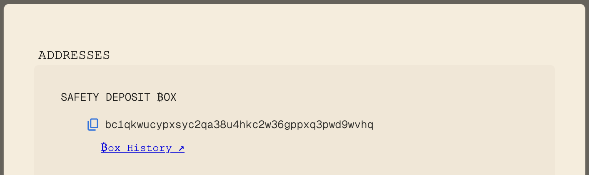
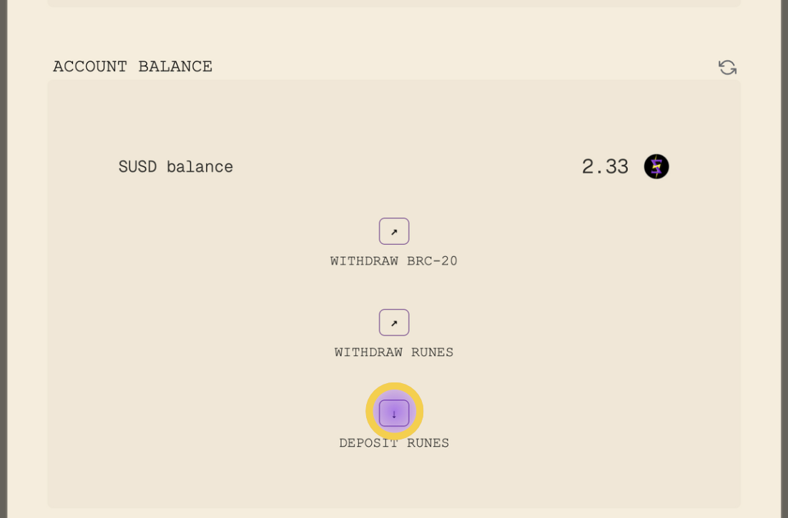
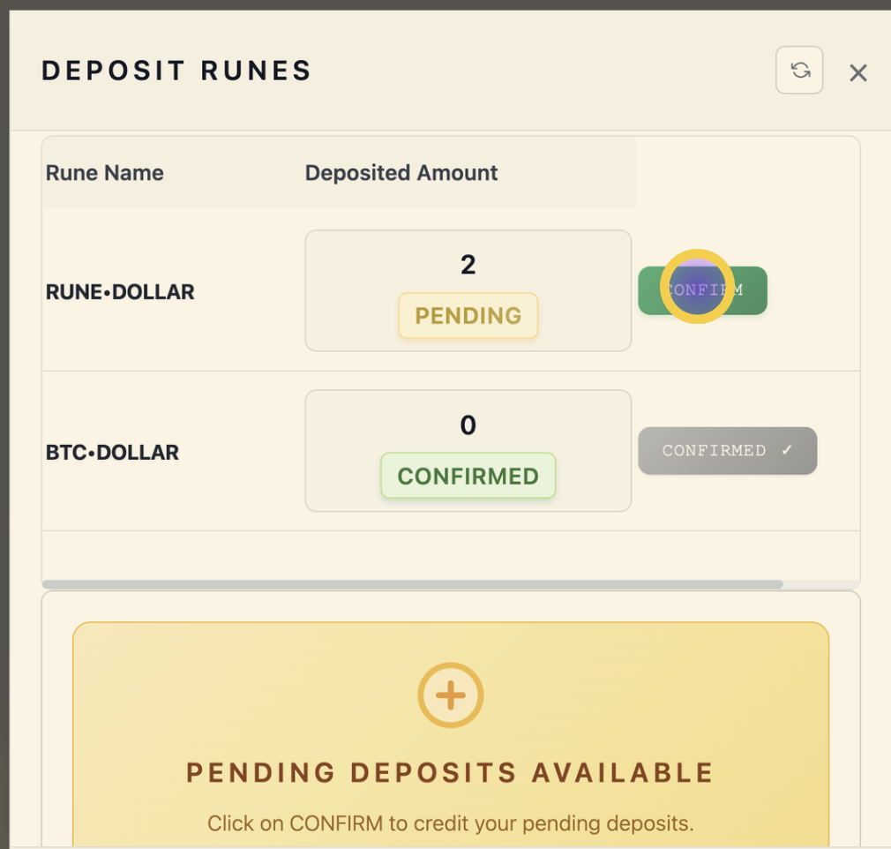
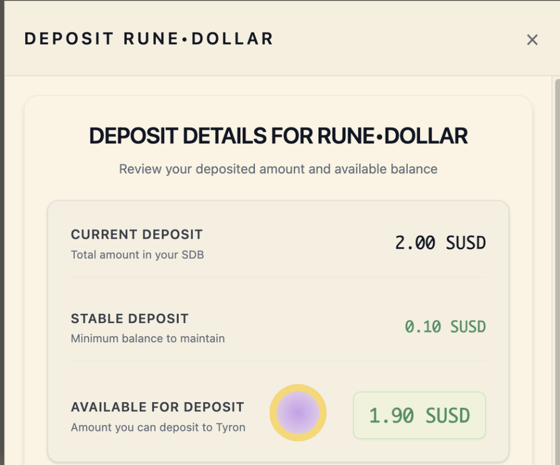
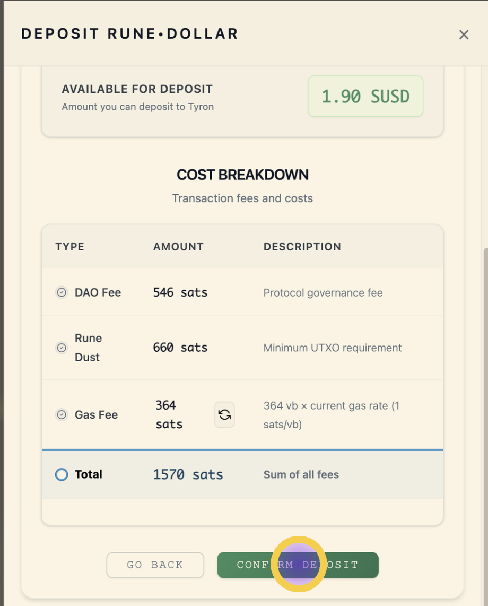

# Deposit Runes

## What is a Runes Deposit?

Depositing Runes allows you to transfer your Rune stablecoins into your Tyron account balance. Once deposited, you can use these tokens within the TyronDAO platform or withdraw them later.

### Step 1: Send Runes

Send Rune stablecoins to your Safety Deposit ₿ox address (displayed in the interface). This is your personal, secure vault on the Bitcoin network.

For this transfer, you can use any wallet that supports the Runes standard.

### Step 2: Confirm Rune Deposit

Navigate to the DEPOSIT RUNES interface to view your pending deposits:

Here you will see the status of your current deposits, which you need to confirm to add them to your account balance:

#### Stable Deposit

There is a minimum runes deposit that must remain in your Safety Deposit Box. Your credited amount will be your deposited runes minus the stable deposit.

- **Stable Deposit:** 0.1 SUSD

This minimum deposit is required for security measures related to how runes transactions work. When you redeem your BTC, this stable deposit will be burned permanently.

#### Transaction Confirmation

To operate on Bitcoin Mainnet, certain fees apply as explained in the cost breakdown:

Transaction costs must be covered by your Safety Deposit Box balance. Therefore, Tyron guides you to ensure that there are sufficient funds to cover these fees.

## Runes Minter Address

There are two versions of the runes minter, with the following addresses:

- [v1: bc1qhtux6m8zptg0qtcml8nap7te90epqmu8sag3du](https://mempool.space/address/bc1qhtux6m8zptg0qtcml8nap7te90epqmu8sag3du)

- [v2: bc1qdqyd353q758qytkdxklx9uq8yn2gf98ll8hrlg](https://mempool.space/address/bc1qdqyd353q758qytkdxklx9uq8yn2gf98ll8hrlg)

These addresses receive runes from Safety Deposit Boxes, effectively removing them from circulation.

### Transaction Examples

#### Withdrawing runes

- [https://mempool.space/tx/24d66e77be26505729bb80d443456050a2a5efe8af5d185d90c77f183aa5e1cc](https://mempool.space/tx/24d66e77be26505729bb80d443456050a2a5efe8af5d185d90c77f183aa5e1cc)

- [https://mempool.space/tx/fb7a30b17d779c372fc0caa758140dacbe47a56213b0d1e22f1651a086d50b62](https://mempool.space/tx/fb7a30b17d779c372fc0caa758140dacbe47a56213b0d1e22f1651a086d50b62)

- With DAO fee: [https://mempool.space/tx/be3ac8b88b09c675296eda99d595387e06080d94f15fe337549cb2ca51ed659e](https://mempool.space/tx/be3ac8b88b09c675296eda99d595387e06080d94f15fe337549cb2ca51ed659e)

#### Depositing runes

- [https://mempool.space/tx/43efd3c9ecb3d07300757524c46a4f1b6b2ebf8d9b49e62fbb6f32c1e1f79343](https://mempool.space/tx/43efd3c9ecb3d07300757524c46a4f1b6b2ebf8d9b49e62fbb6f32c1e1f79343)

- [https://mempool.space/tx/9ac589653415ffe96a5ce694a7f471591f44319cad7ce89e325a07eee043cfe6](https://mempool.space/tx/9ac589653415ffe96a5ce694a7f471591f44319cad7ce89e325a07eee043cfe6)
