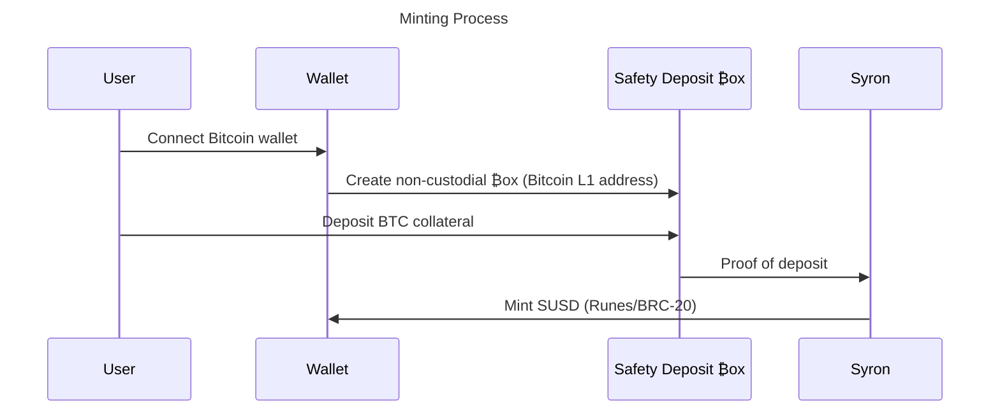
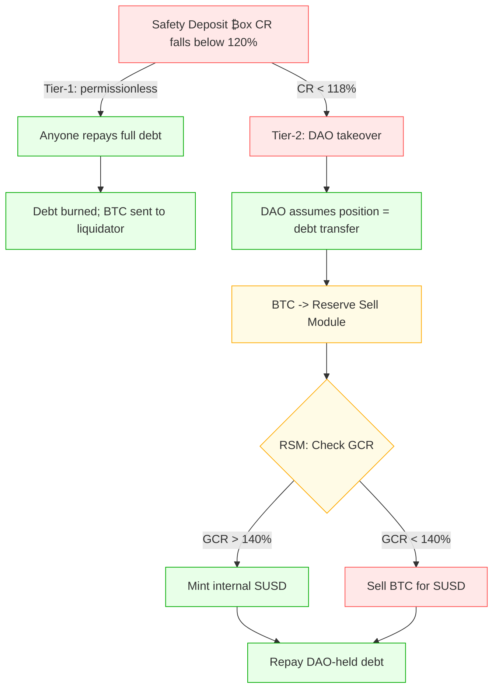
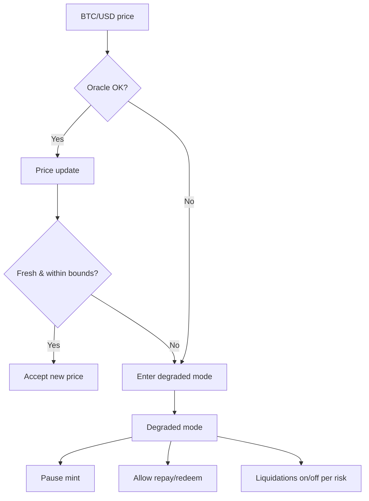
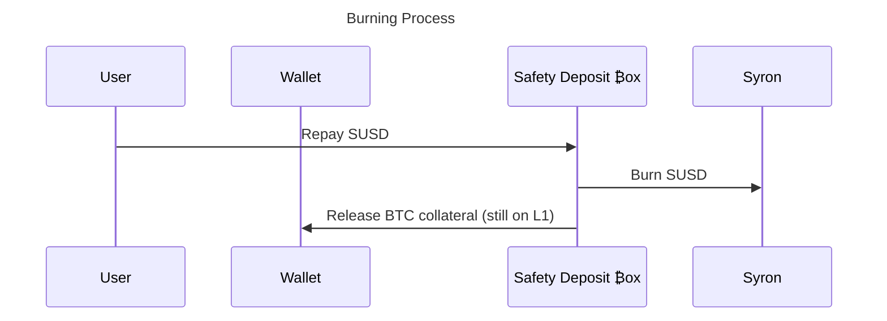

# Syron: BTC-Collateralized Stablecoins with Bitcoin Layer 1 Distribution

**Xalkan Duarte**, Founder & Protocol Engineer · xalkan@tyrondao.org

> **TL;DR**  
> Syron lets users access USD liquidity without selling their BTC. Users lock Bitcoin in non-custodial Safety Deposit ₿oxes (native Bitcoin L1 addresses) and mint overcollateralized SUSD that runs on Layer 1 as Runes or BRC-20. The first implementation uses the Internet Computer's Bitcoin integration to build a decentralized platform. This enables users to preserve full BTC ownership while receiving instant dollar-denominated liquidity. It solves the core dilemma for Bitcoin holders: accessing cash flow without disrupting long-term BTC accumulation strategies. The collateral never leaves Bitcoin L1. Syron is currently live testing collateral flow and token issuance on Bitcoin mainnet with Runes and BRC-20 support.

## Abstract

This whitepaper presents Syron, a decentralized protocol for issuing Bitcoin-collateralized stablecoins that preserve user custody on Bitcoin Layer 1 and enable instant liquidity access. As Bitcoin adoption grows, holders increasingly face a liquidity paradox: they need dollar-denominated cash flow but refuse to sell their appreciating BTC. Existing solutions require wrapped Bitcoin, custody transfer, or complex bridging mechanisms that compromise the core Bitcoin value proposition of security and decentralization.

Syron's first implementation addresses this challenge using Internet Computer smart contracts, which can read/write to Bitcoin without wrapped assets - see the Appendix A for details. With a trust-minimized and non‑custodial Safety Deposit ₿ox architecture, SUSD is a USD-pegged stablecoin that locks BTC in user-owned vaults while allowing them to mint stablecoins directly on Bitcoin Layer 1. Users retain full ownership of their Bitcoin collateral and can mint Syron stablecoins at 66.67% loan-to-value ratio, requiring a 150% collateralization ratio (CR). This Safety Deposit ₿ox system — non-custodial, programmable vaults linked to user wallets — preserves Bitcoin's decentralized custody and provides dollar liquidity as Runes and BRC-20 stablecoins.

Built on principles of monetary self-determination and financial sovereignty (direct individual control over money, without reliance on banks or states), Syron enables users to "be their own bank" without intermediaries, custody risks, or wrapped token complications. This paper outlines the broader implications, technical architecture, and implementation details of Bitcoin-backed infrastructure for decentralized stablecoins.

For technical readers, additional details on the Internet Computer implementation, future development roadmap, and module breakdown are provided in the appendices.

## Introduction: The Bitcoin Liquidity Problem

Bitcoin as the world's most appreciating digital asset faces a fundamental paradox in today's financial system. BTC holders need dollar liquidity but prefer not to sell, creating a forced choice between maintaining Bitcoin exposure and meeting real-world financial needs — a problem that shouldn't exist in a properly functioning monetary system.

### Current Inadequate Solutions

Today's options force trade-offs:

- **Selling Bitcoin:** The most direct approach, but holders miss future appreciation and face tax implications. For long-term Bitcoin believers, selling defeats the purpose of accumulation strategies.

- **Wrapped Bitcoin (wBTC):** Requires transferring custody to centralized entities, violating Bitcoin's "not your keys, not your coins" principle. Counterparty risk hinders the self-sovereignty that makes Bitcoin valuable in the first place.

- **Centralized Lending:** Platforms like BlockFi and Celsius have demonstrated the custody risks inherent in centralized crypto lending models. Most users who trusted these platforms lost their Bitcoin entirely.

- **Lightning Network Solutions:** Lightning-based lending remains operationally complex and liquidity-constrained.

### The Syron Solution

Syron introduces a new paradigm: Bitcoin-collateralized stablecoins that preserve user custody while providing instant dollar liquidity. Through Safety Deposit ₿ox smart contracts users can:

- **Lock Bitcoin** in non-custodial Bitcoin L1 wallets they control
- **Mint SUSD stablecoins** pegged to USD up to 66.67% of collateral value (per v1 LTV ratio)
- **Maintain ownership** of Bitcoin throughout the loan period
- **Access liquidity** for payments, investments, or operational needs
- **Choose token standards** between BRC-20 and Runes formats

This approach preserves Bitcoin's core value propositions — self-custody, censorship resistance, and monetary sovereignty — while solving the liquidity accessibility problem.

> Note: Syron's technical architecture serves broader principles of monetary self-determination. For detailed analysis of centralized monetary systems and their socio-political implications, see ["The Crisis of Self-Determination in the Age of Centralized States & Currencies"](whitepapers/self-determination.md).

## Technical Architecture

### Safety Deposit ₿ox Infrastructure

The Safety Deposit ₿ox represents Syron's core innovation: a non-custodial smart contract wallet that enables Bitcoin collateralization without custody transfer. Each user generates a unique Safety Deposit ₿ox by connecting their self-custodial wallet, creating an auditable vault that they fully control.

**Key Features:**

- **Non-Custodial:** Users maintain full control over deposited Bitcoin through open-source, trustless code
- **Deterministic:** Each Safety Deposit ₿ox is uniquely tied to its controlling self-custodial wallet - funds can only be withdrawn to that wallet
- **Auditable:** All collateral holdings are transparently verifiable on-chain with native Bitcoin addresses
- **Programmable:** Smart contract logic handles collateralization ratios and liquidation protection
- **Interoperable:** Works with existing Bitcoin wallets without additional software
- **Key Management:** Safety Deposit ₿oxes use threshold signing (tECDSA in v1), with deterministic derivation paths bound to each user wallet. This ensures all BTC spends remain non-custodial and policy-gated.

The Safety Deposit ₿ox architecture builds on proven self-sovereign identity (SSI) principles developed by TyronDAO and supported by Zilliqa Research and the DFINITY Foundation, extending identity-controlled custody to Bitcoin-backed stablecoins.

### Dual Token Standard Implementation

Syron SUSD launches with support for BRC-20 and Runes token standards, providing users with comprehensive choice across the Bitcoin ecosystem:

**BRC-20 Format:**

- Established ecosystem with existing wallet and exchange support
- Proven infrastructure for Bitcoin-native token interactions
- Broader liquidity venue availability, though with higher on-chain overhead

**Runes Format:**

- UTXO-based model that avoids inscription overhead, requiring fewer transactions and resulting in lower costs
- Rapid adoption within the Ordinals community, especially among early DeFi and NFT users
- Designed to reduce blockchain bloat through more efficient state handling

This dual implementation demonstrates Syron's advanced architecture while maintaining Bitcoin as the sole collateral asset. Users can choose their preferred token standard based on intended use cases, wallet compatibility, and personal preferences.

### Minting Process

1. **Wallet Connection:** Users connect their self-custodial Bitcoin wallets to generate their unique Safety Deposit ₿ox address
2. **Bitcoin Deposit:** BTC is transferred to the user-controlled, non-custodial Safety Deposit ₿ox wallet
3. **Collateral Verification:** Tyron confirms deposit and calculates available minting capacity
4. **SUSD Generation:** Users mint up to 66.67% of collateral value in SUSD tokens (150% collateralization ratio)
5. **Token Selection:** Choose between the BRC-20 or Runes formats

### Protocol Invariants & Parameters

#### Syron Invariants

Mathematical properties that must always hold true:

- **No net SUSD mint at Tier-1 liquidation:**  
  $$\Delta SUSD = -D$$ (all outstanding debt is repaid and burned).

- **Tier-2 DAO takeover:**  
  $$\Delta SUSD \leq 0$$.  
  Even if the DAO mints SUSD to stabilize GCR, these tokens are minted internally and immediately burned against DAO-held debt — no circulating expansion occurs.

- **Seized BTC locked until sale:**  
  BTC collateral seized in Tier-2 remains locked and cannot move except via the Reserve Sell Module (RSM).

- **Global Collateral Ratio (GCR) floor:**  
  The Reserve Sell Module (RSM) only sells BTC when  
  $$\text{GCR} \leq 140\%$$.  
  If $$\text{GCR} > 140\%$$, no sales occur. Instead, the DAO mints SUSD internally and immediately repays/cancels DAO-held debt, restoring GCR without increasing circulating supply.

<!-- - **Execution buffer:**
  Tier-2 executes only when
  \[
  CR\_{\text{box}} \geq 103\% + \text{fees}
  \]
  with buffer = 3%. This ensures liquidations only occur when collateral exceeds debt by at least all protocol fees plus a 3% volatility buffer
  (e.g., with a 0.5% fee, execution requires ≥ 103.5% CR). -->

#### Syron Parameters

Configurable values that control platform behavior:

**Collateral Ratio Thresholds**

- CR_init: 150% (initial collateralization)
- Tier-1: 120% (permissionless liquidation trigger)
- Tier-2: 118% (DAO takeover threshold)
- Tier-1 window: CR-band [118%, 120%]

**Reserve Sell Module (RSM)**

- Base fee: 50 basis points (0.5%)
- No BTC selling allowed if GCR > 140%

### Liquidation & Risk Management

Two-tier, full-closeout liquidation design ensures deterministic thresholds and supply alignment by burning debt (no net SUSD expansion). Collateral always remains on Bitcoin L1 inside Safety Deposit ₿oxes.

#### Tiered Liquidation Triggers

- **CR_init = 150% (66.67% LTV)** at mint
- **Tier-1 — Permissionless at 120% CR:**  
  If a vault's CR hits 120%, any SUSD holder may repay the full debt. The protocol burns the repaid SUSD and transfers BTC collateral to the liquidator's self-custodial wallet
- **Tier-2 — DAO takeover at 118% CR (debt transfer):**
  If CR drops below 118%, the DAO assumes the position to cancel the debt. The BTC collateral is transferred to a DAO treasury address to back the assumed liability. No tokens are minted

**Tier-1 window:** Public liquidations are open while CR ∈ [118%, 120%] (no timer).

> Note: **150% → 120%** corresponds to an exact 20% BTC price decline at constant debt, since $$1.20/1.50 = 0.80$$ (i.e., BTC drops to 80% of its original value).

**Tiered liquidation flow**

### Oracle & Circuit Breakers

Syron implements a robust oracle system for BTC/USD pricing with built-in circuit breakers to protect against price manipulation and system failures.

- **Heartbeat:** Poll every 60 seconds
- **Stale threshold:** Price older than 300 seconds → degraded mode
- **Degraded mode:** Pause mint; allow burn (repay/redeem); toggle liquidations per risk
- **Aggregation:** Median/quorum validation for price accuracy

**Oracle and circuit breaker logic**

### Burning & Collateral Redemption

**Loan Repayment:** Users repay SUSD loans to unlock their Bitcoin collateral. Repayment can be partial or complete, with collateral released proportionally. In v1, only full repayment is supported, which releases all collateral. Partial repayment and proportional release can be planned for later versions.

**Collateral Addition:** Users can deposit additional Bitcoin to their Safety Deposit ₿ox to improve their collateralization ratio and mint additional SUSD.

**Liquidation Protection:** The protocol enforces automated liquidations if collateralization drops to unsafe levels, while users can manually add collateral or repay SUSD to maintain position health.

### Real-World Applications

**Business Operations:** Bitcoin-holding companies can access working capital without selling their treasury reserves, maintaining long-term BTC exposure while funding operations.

**Personal Liquidity:** Individual holders can access cash for major purchases, emergencies, or investment opportunities without disrupting their Bitcoin accumulation strategies.

**DeFi Integration:** SUSD tokens can be used across Decentralized Finance protocols, enabling yield farming and liquidity provision while maintaining Bitcoin backing.

**Global Payments:** SUSD provides stable value transfer capabilities backed by Bitcoin's security and decentralization, ideal for international transactions and remittances.

## Current Deployment Status

Syron is currently live in testing on Bitcoin Layer 1 with core functionality operational on mainnet:

**Available Features:**

- Safety Deposit ₿ox creation and Bitcoin collateral deposits
- SUSD minting in BRC-20 and Runes formats
- Secure redemption mechanisms for Bitcoin collateral recovery
  <!-- - Gasless payment system via Internet Computer integration -->
  <!-- - Cross-chain SUSD utility across Bitcoin and ICP ecosystems -->

**Ongoing Optimization:**

- Collateral management interface improvements
- Enhanced liquidation process mechanisms
- Community governance and TYRON token integration

**Access:** Users can interact with Syron through the TyronDAO App, with technical guides and documentation available in the Components section.

## Conclusion

Syron delivers USD liquidity while BTC collateral stays on Bitcoin L1 in user-controlled vaults. It addresses Bitcoin's fundamental liquidity challenge without compromising the cryptocurrency's core value propositions. By combining Safety Deposit ₿ox smart contracts with BTC, SUSD runs on Bitcoin L1 (Runes/BRC-20) enabling holders to access dollar-denominated liquidity without sacrificing self-custody, censorship resistance, or long-term investment strategies.

The two-tier liquidation design keeps the supply aligned and keeps the system solvent under stress. The dual BRC-20 and Runes implementation ensures compatibility across Bitcoin's evolving ecosystem. Current mainnet deployment demonstrates the protocol's readiness for real-world usage, with ongoing optimizations preparing for broader adoption.

As Bitcoin continues its evolution from digital gold to global monetary infrastructure, Syron unlocks productive use of BTC capital by solving the liquidity paradox through self-custodial mechanisms. Syron extends Bitcoin finance on Bitcoin's own ledger, representing a crucial step toward a more sovereign financial system.

The protocol invites Bitcoin holders, developers, and DeFi participants to explore this new paradigm of Bitcoin-native finance. Through community participation and continued development, TyronDAO is establishing the standard for self-custodial Bitcoin liquidity solutions in the emerging decentralized economy.

### Appendix A: Internet Computer Implementation

Syron leverages ICP's Chain Fusion technology to connect Bitcoin Layer 1 with Internet Computer smart contract capabilities. This implementation enables:

**Native Bitcoin Integration:** Direct BTC interaction without wrapping or bridging mechanisms that introduce counterparty risk.

**Smart Contract Logic:** Internet Computer provides the computational environment for stablecoin management while Bitcoin remains the settlement layer.

**Real-Time Oracles:** Price feeds and collateralization monitoring through Internet Computer's Exchange Rate Canister and HTTPS outcalls eliminate reliance on external oracle networks.

**Gasless Transactions:** ICP's reverse gas model enables users to utilize our Internet Computer integration without holding additional tokens for transaction fees.

### Appendix B: Future Development Roadmap

#### Multi-Stablecoin Ecosystem

While SUSD represents Syron's initial implementation, the metaprotocol architecture supports multiple fiat-pegged stablecoins, all overcollateralized with Bitcoin:

**Planned Additions:**

- USDT/USDC borrowing options using the same Bitcoin collateral
- Regional stablecoin implementations for specific market needs
- Community-governed stablecoin proposals through DAO mechanisms

#### Governance Evolution

**TyronDAO Governance:** The protocol will transition to community governance through TYRON token mechanisms, enabling stakeholder participation in:

- Collateralization ratio adjustments and fees
- New assets and stablecoin implementations
- Protocol upgrade proposals
- Risk parameter modifications

**Progressive Decentralization:** Tyron's Decentralized Autonomous Organization is distributing control among TYRON token holders, ensuring long-term decentralization and community ownership.

### Appendix C: Implementation Modules

| Module                                | Summary                                                                                   | Priority |
| ------------------------------------- | ----------------------------------------------------------------------------------------- | -------- |
| **Safety Deposit Box with tECDSA**    | Non-custodial Bitcoin L1 vaults using threshold ECDSA for secure key management           | P0       |
| **Mint/Burn Operations**              | Core SUSD issuance and redemption mechanisms for collateral management                    | P0       |
| **Tier-1 Permissionless Liquidation** | At 120% CR, anyone can repay full debt; SUSD is burned; BTC goes to the liquidator.       | P0       |
| **Tier-2 DAO Takeover**               | At 118 % CR, DAO assumes the position; cancels the debt; transfers BTC collateral to RSM. | P1       |
| **Oracle & Circuit Breakers**         | Enforces heartbeat/stale rules; degraded-mode controls.                                   | P1       |
| **Reserve Sell Module (RSM)**         | Sells BTC for SUSD at oracle ± fee; enforces GCR floor and quotas                         | P1       |
| **Failover Auction**                  | Widening-discount auction if Tier-1/2 blocked or GCR floor threatened.                    | P2       |

---
